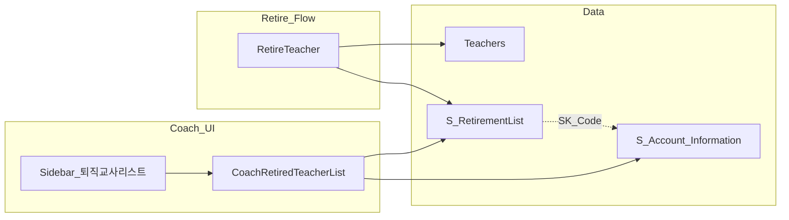

# Coach 퇴직교사 리스트 구현 계획

> `write-plan` 커맨드는 deprecated입니다. 이후 계획 수정·실행 시 **superpowers writing-plans** 스킬 사용을 권장합니다.

## 개발 목표

- Coach Team 사이드바에 **퇴직교사 리스트** 메뉴·페이지 추가
- 목록 SSOT: 레거시 테이블 **`S_RetirementList`** (운영 DB 스키마 기준)
- 교사 지원 화면 **퇴직 처리** 시 [`RetireTeacher`](app/Actions/RetireTeacher.php)가 `Teachers.Status` 갱신과 함께 **`S_RetirementList`에도 기록** (사용자 확인)

## 현재 구조 (조사 결과)

| 항목 | 상태 |
|------|------|
| `S_RetirementList` | 코드베이스·SQLite 테스트 DB에 **정의 없음** → **운영/스테이징 조회로 확정** (사용자 선택) |
| Coach 전용 라우트 | [`coach.teacher-support.index`](routes/web.php) 1개만 존재 |
| Coach 메뉴 | [`resources/views/components/layouts/app.blade.php`](resources/views/components/layouts/app.blade.php) Coach 블록 (~299행) |
| 퇴직 처리 | [`RetireTeacher`](app/Actions/RetireTeacher.php) → `Teachers`만 `Status='퇴직'`, `ClassInOut=false` |
| TR 스코프 | [`CoachTeacherScope`](app/Support/CoachTeacherScope.php) — `S_Account_Information.TR` 기준 |
| 참고 UI 패턴 | [`ContactList`](app/Livewire/ContactList.php) (검색·페이지네이션·모달), [`CoachTeacherSupportList`](app/Livewire/CoachTeacherSupportList.php) (직급 배지·기관명) |



---

## 0단계: 스키마 확정 (구현 게이트)

**로컬 SQLite에는 테이블이 없으므로**, 구현 착수 전 운영/스테이징에서 다음을 수행합니다.

1. Boost `database-schema` (`filter=Retirement`) 또는 `database-query`로 컬럼·PK·인덱스 확인
2. 레거시 화면(있으면)과 대조해 **표시 컬럼·정렬·검색 필드** 확정
3. [`config/coach_retired_teachers.php`](config/coach_retired_teachers.php) (신규)에 컬럼 매핑 문서화  
   - 예: `teacher_id`, `sk_code`, `name`, `position`, `school_name`, `retired_at`, `tr_name` 등 (실제 컬럼명으로 치환)

**테스트 환경 대응**

- `Schema::hasTable('S_RetirementList')` 가드 (기존 [`TeacherSupportHistoryAggregator`](app/Support/TeacherSupportHistoryAggregator.php) 패턴과 동일)
- Feature 테스트용: `tests/Feature/CoachRetiredTeacherListTest.php`에서 **마이그레이션 없이** `Schema::create('S_RetirementList', ...)` 로 최소 스키마 inline 생성 (다른 Coach 테스트와 동일 방식)

**DB migration 정책**

- 운영에 이미 있는 레거시 테이블이면 **CREATE migration 작성하지 않음** ([database-reference-only](.cursor/rules/database-reference-only.mdc))
- 로컬/CI 전용 stub 테이블만 테스트에서 생성

---

## 1단계: 도메인 계층

### 1.1 Eloquent 모델

- 신규 [`app/Models/RetirementList.php`](app/Models/RetirementList.php)
  - `$table = 'S_RetirementList'`
  - `$primaryKey` / `$timestamps` / `casts` — 0단계 스키마 반영
  - `institution(): BelongsTo` — `SK_Code` ↔ `Institution.SKcode` (또는 실제 FK 컬럼명)
  - `teacher(): BelongsTo` — `TeacherId` 등 존재 시 `Teachers.ID` 연결

### 1.2 TR 스코프

- 신규 [`app/Support/CoachRetirementListScope.php`](app/Support/CoachRetirementListScope.php) (또는 `CoachTeacherScope`에 `applyToRetirementList` 추가)
  - admin: 전체
  - Coach TR: `whereHas institution.accountInfo` + `CoachTeacherScope::applyTrScope`와 동일 alias 로직
  - 비 Coach / 미인증: `whereRaw('1=0')`
  - hidden institution 제외는 [`CoachTeacherScope::excludeHiddenInstitutions`](app/Support/CoachTeacherScope.php) 재사용 검토

### 1.3 퇴직 처리 이중 기록

- [`app/Actions/RetireTeacher.php`](app/Actions/RetireTeacher.php) 확장
  - `DB::transaction` 내:
    1. 기존 `Teachers` update 유지
    2. `S_RetirementList` **INSERT** (또는 레거시 규칙이 UPDATE면 upsert)
  - 매핑은 `config/coach_retired_teachers.php` + 전용 `RetirementListWriter` 클래스로 분리 (Action 비대화 방지)
  - **중복 퇴직**: 동일 `TeacherId` 재처리 시 레거시 동작 확인 후 unique 제약·skip·update 중 하나 선택
- [`tests/Feature/RetireTeacherTest.php`](tests/Feature/RetireTeacherTest.php) 신규 또는 [`CoachTeacherSupportListTest`](tests/Feature/CoachTeacherSupportListTest.php) 보강

---

## 2단계: UI / 라우팅

### 2.1 라우트·페이지

| 항목 | 내용 |
|------|------|
| Path | `/coach/retired-teachers` |
| Name | `coach.retired-teachers.index` |
| Page | [`resources/views/pages/coach/retired-teachers/index.blade.php`](resources/views/pages/coach/retired-teachers/index.blade.php) |
| Livewire | [`app/Livewire/CoachRetiredTeacherList.php`](app/Livewire/CoachRetiredTeacherList.php) |
| View | [`resources/views/livewire/coach-retired-teacher-list.blade.php`](resources/views/livewire/coach-retired-teacher-list.blade.php) |

[`routes/web.php`](routes/web.php)의 `auth` 그룹에 closure view 반환 패턴 유지 ([`coach.teacher-support.index`](routes/web.php)와 동일).

### 2.2 사이드바

[`app.blade.php`](resources/views/components/layouts/app.blade.php) Coach `sidebar-sublist`에 **교사 지원 현황** 바로 아래 항목 추가:

- 라벨: `퇴직교사 리스트`
- URL: `/coach/retired-teachers?team_menu=coach`
- active: `request()->routeIs('coach.retired-teachers.*')`
- (선택) `$isCoTeamRoute`에 `coach*` 포함 — Coach 전용 URL에서 Teams 아코디언 기본 열림 정합

### 2.3 목록 UX (MVP)

**기본 컬럼** (스키마 확정 후 조정):

- 기관명 (`resolvedAccountName` — [`Institution::resolvedAccountName()`](app/Models/Institution.php))
- SK 코드
- 교사명
- 직급 (퇴직 배지: 기존 `bg-red-100 text-red-800` 재사용)
- 퇴직일
- 담당 TR (테이블·join 컬럼에 따라)

**기능**

- `WithPagination` (50건, 교사 지원 목록과 동일)
- 검색: 이름·기관명·SK (공백 제거 LIKE — `CoachTeacherSupportList` 검색 패턴 재사용)
- 연도 필터: 퇴직일 컬럼 기준 (컬럼 존재 시)
- 정렬 기본: 퇴직일 내림차순
- 행 클릭: (1차) 읽기 전용 상세 모달 또는 기존 `openTeacherModal` 연동 — **퇴직 교사는 전용 페이지에서만 조회** 권장, 교사 지원 목록 「퇴직 포함」 체크와 역할 분리

**빈 상태**

- 테이블 없음 / TR scope 결과 0건 메시지 분리

---

## 3단계: 교사 지원 현황과의 관계

| 화면 | 역할 |
|------|------|
| 교사 지원 현황 | 활성 교사 + (선택) 「퇴직 포함」 빠른 조회 |
| **퇴직교사 리스트** | `S_RetirementList` 기반 **공식 퇴직 이력** |

구현 후 **권장** (별 PR 또는 직후):

- 교사 지원 「퇴직 포함」 체크 제거 → 퇴직은 전용 메뉴만 사용 (혼란 감소)

**MVP 수용 기준 (데이터):**

- 목록에 보이는 행 = `S_RetirementList`에 존재하는 행만
- 레거시 `Teachers.Status=퇴직`만 있고 RetirementList에 없는 교사는 MVP에서 **미표시** (backfill 후속)

---

## 4단계: 테스트·검증

### Feature tests — `tests/Feature/CoachRetiredTeacherListTest.php`

- TR 사용자: 본인 TR 기관 퇴직 교사만 노출
- admin: 전체 노출
- 타 TR 기관 퇴직 교사 비노출
- 검색·연도 필터
- `RetireTeacher` 실행 시 `S_RetirementList` 1행 생성 (stub 테이블)

### 검증 명령

```bash
vendor/bin/pint --dirty
php artisan test --compact tests/Feature/CoachRetiredTeacherListTest.php
php artisan test --compact tests/Feature/RetireTeacherTest.php  # 또는 통합
composer run verify
```

### 수동 QA

- Coach 계정 / admin 각각 메뉴·목록·검색
- 교사 지원에서 퇴직 처리 → 퇴직교사 리스트에 즉시 반영 여부
- `?team_menu=coach` 유지 시 사이드바 Coach 패널 열림

---

## 작업 범위 (파일)

| 구분 | 파일 |
|------|------|
| 신규 | `RetirementList` model, `CoachRetiredTeacherList` Livewire+view, page blade, `CoachRetirementListScope`, `RetirementListWriter`, `config/coach_retired_teachers.php`, Feature tests |
| 수정 | `routes/web.php`, `app.blade.php` (menu), `RetireTeacher.php` |
| 건드리지 않음 | `GSBrochure/`, `ContactList` 퇴직 탭 로직(별도 이슈), 대규모 `CoachTeacherSupportList` 리팩터 |

**DB 변경**: 운영 테이블 CREATE migration 없음. 테스트 stub만.

---

## 위험 요소

| 위험 | 대응 |
|------|------|
| 스키마 불명확 | **0단계 게이트** — 컬럼 매핑 config 없이 UI 구현 금지 |
| 레거시 중복 행 | 퇴직 처리 시 idempotent 규칙·테스트 |
| `Teachers` vs `S_RetirementList` 불일치 | MVP는 RetirementList만 표시; backfill 커맨드는 **후속 PR** (CEO 확정) |
| TR scope join 비용 | `SK_Code` 인덱스 확인, eager load `institution.accountInfo` |
| 브랜치 혼잡 | `feature/coach-retired-teacher-list` **단일 의도 PR** ([git-workflow](.cursor/rules/git-workflow-pr-split.mdc)) |

---

## 계획 리뷰

- **승인 가능 여부**: 0단계 스키마 확정 후 진행 가능
- **보완 필요**: 운영 DB 조회 결과(컬럼 목록)를 config에 반영하는 체크리스트
- **구현 순서**: 스키마 → model/config/scope → RetireTeacher 이중 기록 → Livewire UI → menu/route → tests → verify
- **코드 작성 전 확인**: 레거시 퇴직 리스트 화면 캡처·정렬·중복 규칙, `S_RetirementList` PK/unique

---

## CEO 리뷰 요약 (2026-05-20)

### 판정

**조건부 승인.** 방향·파일 구조·TR 스코프 재사용은 타당. **0단계 스키마 확정 없이 구현 착수 금지.**

### 0A. 전제

- **맞는 문제:** Coach TR이 퇴직 교사 이력을 교사지원 그리드와 분리해 조회해야 함.
- **SSOT 선택:** `S_RetirementList` — 사용자·운영 DB 조회 합의. `Teachers.Status`만으로 목록 만들지 않음.
- **하지 않으면:** 교사지원 「퇴직 포함」 체크로 임시 조회 가능하나, **공식 퇴직 이력·레거시 정합**은 전용 페이지가 필요.

### 0C-bis. 구현 대안

| 접근 | 요약 | 권장 |
|------|------|------|
| **A. 최소** | `RetirementList` + 단순 Livewire, `RetireTeacher` INSERT만 | 2차 PR에 scope 분리 시 |
| **B. 계획안** | config 매핑, `RetirementListWriter`, `CoachRetirementListScope`, 이중기록 트랜잭션, Feature 테스트 | **권장** |
| **C. Teachers UNION** | `Status=퇴직` + RetirementList 합집합 | SSOT 혼선, 레거시 이관 목적과 충돌 → **비권장** |

### CRITICAL GAP (구현 전 해결)

1. **스키마 미확인** — repo/CI SQLite에 테이블 없음. 운영 `database-schema`로 PK, unique, 퇴직일 컬럼명 확정 필수.
2. **과거 데이터** — MVP는 `S_RetirementList` 행만 표시. `Teachers`만 퇴직인 레거시 행은 **backfill 별도 PR** (수용 기준에 “MVP에 과거 전원 미표시 가능” 명시).
3. **이중 SSOT** — `RetireTeacher`는 **트랜잭션**으로 Teachers + RetirementList 동시 성공/실패. 중복 퇴직은 idempotent(INSERT skip 또는 UPDATE) 규칙을 레거시와 대조 후 config에 고정.
4. **제품 역할 겹침** — 교사지원 「퇴직 포함」 vs 전용 메뉴. MVP 후 **체크박스 제거**를 같은 PR 또는 직후 PR로 정리 권장 (현재: 수업미참여는 기본 노출, 퇴직만 체크).
5. **브랜치** — `feature/employee-password-reset-link`와 분리. **`feature/coach-retired-teacher-list`** from `main` 권장.

### 아키텍처 (요약)

```
[RetireTeacher] --tx--> Teachers (Status, ClassInOut)
              \------> S_RetirementList (snapshot row)

[CoachRetiredTeacherList] --> RetirementList::query()
                         --> CoachRetirementListScope (TR / admin)
                         --> join Institution / AccountInformation
```

### 보안·권한

- 목록·퇴직 처리 모두 **CoachTeacherScope**와 동일 TR 경계.
- admin만 전체 퇴직 이력. 비 Coach는 403 또는 빈 목록(기존 패턴 따름).

### 테스트 (2am Friday 기준)

- TR A는 A 기관 퇴직만, B 기관 퇴직 비노출
- `RetireTeacher` 후 RetirementList 1행 + Teachers.Status
- 중복 퇴직 idempotent
- 테이블 없을 때 `Schema::hasTable` — 빈 상태 UI (크래시 없음)

### NOT in scope (MVP)

- `ContactList` 재직/퇴직 탭 `ClassInOut` 정리
- 전 기간 backfill 커맨드 (후속 PR)
- `CoachTeacherSupportList` 대규모 리팩터
- RetirementList 행 수정/삭제 UI

### Dream state (12개월)

퇴직 이력 = RetirementList SSOT, 교사지원은 활성 교사만, backfill 완료, 퇴직 시 자동 스냅샷+감사 로그.

---

## GSTACK REVIEW REPORT

| Review | Trigger | Why | Runs | Status | Findings |
|--------|---------|-----|------|--------|----------|
| CEO Review | `/plan-ceo-review` | Scope & strategy | 1 | ISSUES_OPEN | 5 gaps; HOLD 권장; schema gate |
| Codex Review | `/codex review` | Independent 2nd opinion | 0 | — | — |
| Eng Review | `/plan-eng-review` | Architecture & tests (required) | 0 | — | — |
| Design Review | `/plan-design-review` | UI/UX gaps | 0 | — | UI scope — design review 권장 |

**CEO 결정 (확정):** HOLD SCOPE · MVP는 `S_RetirementList`만 표시 · backfill은 후속 PR

**VERDICT:** CEO 승인 (조건: 0단계 스키마) — `/plan-eng-review` 후 구현
