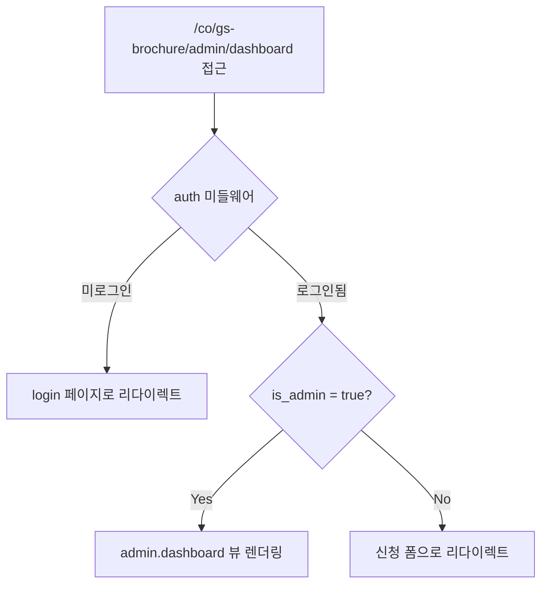

# GS Brochure Admin Guard Plan

## 목표

`/co/gs-brochure/admin/*` 경로에 접근할 때 `is_admin = true` 인 사용자만 허용하고, 일반 사용자는 신청 폼으로 리다이렉트합니다.

## 구현 방식

Laravel `Gate` (이미 `AppServiceProvider`에 정의 패턴이 있음)를 활용하여 별도 미들웨어 없이 라우트 클로저에서 권한을 체크합니다.

## 변경 파일

### 1. [`app/Providers/AppServiceProvider.php`](app/Providers/AppServiceProvider.php)

`manageGsBrochureAdmin` Gate를 신규 등록:

```php
Gate::define('manageGsBrochureAdmin', fn (?User $user): bool => (bool) ($user?->is_admin));
```

### 2. [`routes/web.php`](routes/web.php)

관리자 전용 라우트 2개에 `Gate::authorize()` 추가:

- `co.gs-brochure` (분기 라우트) — 관리자 대시보드로 보내기 전 이미 `is_admin` 체크 중이므로 변경 없음
- `co.gs-brochure.admin.login` (login → dashboard 리다이렉트) — `authorize` 추가
- `co.gs-brochure.admin.dashboard` — `authorize` 추가

권한 없을 때 `abort(403)` 대신 **신청 폼으로 리다이렉트**:

```php
Route::get('/co/gs-brochure/admin/login', function () {
    if (! Gate::allows('manageGsBrochureAdmin')) {
        return redirect()->route('co.gs-brochure.request');
    }
    return redirect()->route('co.gs-brochure.admin.dashboard');
})->name('co.gs-brochure.admin.login');

Route::get('/co/gs-brochure/admin/dashboard', function () {
    if (! Gate::allows('manageGsBrochureAdmin')) {
        return redirect()->route('co.gs-brochure.request');
    }
    return view('admin.dashboard');
})->name('co.gs-brochure.admin.dashboard');
```

### 3. 레거시 관리자 리다이렉트 라우트도 동일하게 처리

```php
Route::get('/admin/login', function () {
    if (! Gate::allows('manageGsBrochureAdmin')) {
        return redirect()->route('co.gs-brochure.request');
    }
    return redirect()->route('co.gs-brochure.admin.dashboard');
})->name('gs-brochure.legacy.admin.login');

Route::get('/admin/dashboard', function () {
    if (! Gate::allows('manageGsBrochureAdmin')) {
        return redirect()->route('co.gs-brochure.request');
    }
    return redirect()->route('co.gs-brochure.admin.dashboard');
})->name('gs-brochure.legacy.admin.dashboard');
```

## 동작 흐름



## 변경하지 않는 것

- 신청 폼(`co.gs-brochure.request`), 신청 결과, 신청 목록 라우트는 `auth` 미들웨어만 유지 (일반 사용자 접근 허용)
- `Gate::define` 로직은 기존 `manageStoreInventory`와 동일한 패턴 사용