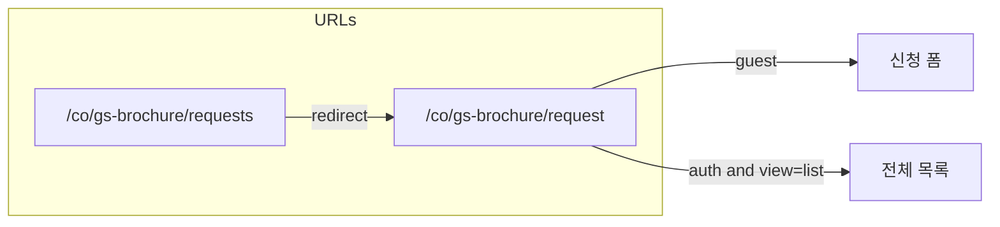

# GS Brochure request / requests 페이지 통합

## 현재 상태

| URL | 레이아웃 | 인증 | 역할 |
|-----|----------|------|------|
| [`/co/gs-brochure/request`](routes/web.php) | [`shell-public`](GSBrochure/laravel/resources/views/layouts/shell-public.blade.php) | 없음 | [`request.form-v2`](GSBrochure/laravel/resources/views/request/form-v2.blade.php) 신청 폼 |
| [`/co/gs-brochure/requests`](routes/web.php) | [`shell`](GSBrochure/laravel/resources/views/layouts/shell.blade.php) | `auth` | [`request.list`](GSBrochure/laravel/resources/views/request/list.blade.php) 전체 목록·검색·편집 UI |

문제: 레이아웃·사이드바 UX가 두 갈래이고, `shell-public`에만 있는 직원용 링크가 별도 URL로 이어져 **이중 진입점**이 됨.

## 목표 UX

- **비로그인**: 지금과 같이 **신청 폼만** (`/co/gs-brochure/request`).
- **로그인 사용자**: 같은 베이스 URL에서 **신청 폼 ↔ 전체 신청 내역** 전환 (탭 또는 쿼리 스위치).
- **`/co/gs-brochure/requests`**: **301/302 리다이렉트**로 통합 URL로만 유도 (북마크·관리자 대시보드 링크 호환).

## 구현 방향 (권장)

### 1) 단일 라우트 + 쿼리 파라미터

- `GET /co/gs-brochure/request?view=list` (이름은 `view` 또는 `panel` 중 하나로 통일)에서 **전체 목록**을 렌더.
- 기본값: 쿼리 없음 = **신청 폼** (`view=form` 생략 가능).
- **`view=list` + 비로그인** → `login`으로 보내고 `intended`에 원 URL 저장(또는 쿼리만 있는 URL), 또는 `view`를 제거한 신청 페이지로 되돌리고 플래시 메시지(정책 선택).

### 2) 라우트 정리 ([`routes/web.php`](routes/web.php))

- `co.gs-brochure.request` 클로저에서 **쿼리에 따라** 새 통합 뷰를 반환 (또는 단일 뷰에 `$showList` 전달).
- `co.gs-brochure.requests`는 **`redirect()->route('co.gs-brochure.request', ['view' => 'list'])`** 로만 처리하고, **별도 `view('request.list')` 제거**.

### 3) 뷰 구조 리팩터 (중복 제거 핵심)

- 새 허브 뷰 예: [`GSBrochure/laravel/resources/views/request/brochure-hub.blade.php`](GSBrochure/laravel/resources/views/request/brochure-hub.blade.php) (이름 조정 가능)
  - `@extends('layouts.shell-public')`
  - `@section('content')` 안에서 `@if($showStaffList)` … `@else` … `@endif` 로 **목록 마크업** vs **폼 마크업**만 전환.
- 기존 파일에서 **본문만** 잘라 partial로 이동:
  - `request/_brochure-request-form.blade.php` ← `form-v2`의 `@section('content')` 본문(헤더~폼~모달 등).
  - `request/_staff-requests-list.blade.php` ← `list.blade.php`의 stats/검색/컨테이너/페이지네이션 HTML.
- **스크립트**: `list.blade.php` 하단 인라인 JS(수백 줄)와 `form-v2`의 `@push('scripts')`가 충돌하지 않도록, 허브에서 **한 번의 `@push('scripts')`** 안에
  - 목록용 스크립트는 `@if($showStaffList)` 로 감싸 로드하거나,
  - 공통 `gs-brochure-api.js`는 한 번만 포함하고, 폼/목록 IIFE를 조건부로 실행.
- 기존 [`form-v2.blade.php`](GSBrochure/laravel/resources/views/request/form-v2.blade.php) / [`list.blade.php`](GSBrochure/laravel/resources/views/request/list.blade.php)는 **허브로 include만 하거나**, 라우트에서 더 이상 직접 쓰지 않고 **deprecated 래퍼**로 두지 않는 편이 깔끔함(통합 후 한 파일만 유지 권장).

### 4) [`shell-public`](GSBrochure/laravel/resources/views/layouts/shell-public.blade.php) 사이드바

- **「브로셔 신청」**: `route('co.gs-brochure.request')` (쿼리 없음 또는 `view=form`).
- **「전체 신청 내역」** (`@auth`): `route('co.gs-brochure.request', ['view' => 'list'])` — **별도 `co.gs-brochure.requests` 링크 제거**.
- **공개「신청 내역 조회」**(`list-v2`): 정책상 필요하면 [`gs-brochure.legacy.request.list-v2`](routes/web.php) 링크 유지/복구(현재 로컬 파일에 주석 처리된 구간이 있으면 통합 정책에 맞게 정리).

### 5) `routeIs` / 활성 표시

- `$navRequest`: `request()->routeIs('co.gs-brochure.request') && request('view','form') !== 'list'`
- 직원 목록 활성: 같은 라우트이면서 `request('view') === 'list'`

### 6) 참조 업데이트

- [`admin/dashboard.blade.php`](GSBrochure/laravel/resources/views/admin/dashboard.blade.php), [`request/success.blade.php`](GSBrochure/laravel/resources/views/request/success.blade.php), 기타 `route('co.gs-brochure.requests')` grep 결과를 **`co.gs-brochure.request` + `view=list`** 로 교체(또는 리다이렉트에만 의존).

### 7) 테스트

- `GET /co/gs-brochure/requests` → `assertRedirect` to `.../request?view=list` (또는 선택한 쿼리 키).
- 게스트가 `GET /co/gs-brochure/request?view=list` → 로그인 유도 또는 302 정책에 맞는 assertion.

## 범위 밖 / 후속

- API `GET /api/gs-brochure/requests` 공개 여부는 이번 “페이지 통합”과 별개. 필요 시 별 PR에서 `auth` 보호 검토.

## 요약 다이어그램

