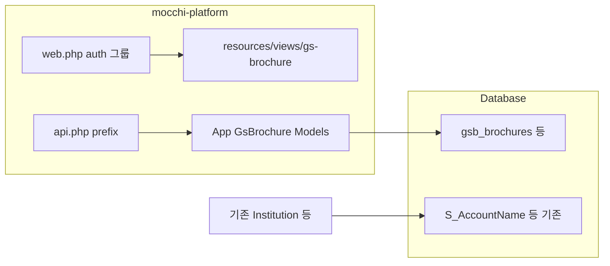

# GS Brochure Laravel → mocchi-platform 통합 계획

## 현재 상태 요약

| 영역 | 모카 ([composer.json](composer.json)) | GS Brochure ([GSBrochure/laravel/composer.json](GSBrochure/laravel/composer.json)) |
|------|----------------------------------------|----------------------------------------------------------------------------------|
| Laravel | 13, PHP 8.3 | 12, PHP 8.2 |
| API 라우트 | [bootstrap/app.php](bootstrap/app.php)에 `api` 미등록 — [routes/api.php](routes/api.php) 없음 | `routes/api.php`에 브로슈어·관리자·인증 등 다수 |
| 모델 충돌 | [app/Models/Institution.php](app/Models/Institution.php)는 `S_AccountName` (CRM) | [GSBrochure/laravel/app/Models/Institution.php](GSBrochure/laravel/app/Models/Institution.php)는 일반 `institutions` 테이블 |
| 인증 | Breeze `User` | 동일 클래스명 `User` + 별도 `AdminUser` |

즉, **파일을 그대로 복사하면 클래스명·테이블명·마이그레이션(`users`, `jobs` 등)이 충돌**합니다. 통합은 “복사”가 아니라 **이름·경로·DB 경계를 재정의하는 이식**입니다.

## 권장 DB 격리 전략 (미결정 시 기본안)

**기본 권장: 같은 DB 연결 + 테이블 접두어** (예: `gsb_` 또는 `brochure_`).

- 이유: 백업·마이그레이션·배포가 단순하고, 모카 `.env` 한 벌로 운영 가능.
- **별도 `database` 연결**(`gs_brochure`)은 운영에서 DB 권한/규모 분리가 필요할 때 적합 (스키마/DB 파일 분리).

선택은 [config/database.php](config/database.php)와 마이그레이션의 `Schema::connection()` / 모델 `$connection` / `$table`로 고정합니다.

## 단계별 작업

### 1) 범위·이름 규칙 확정

- **PHP 네임스페이스**: 예) `App\GsBrochure\Models\*`, `App\GsBrochure\Http\Controllers\Api\*`, 서비스는 `App\GsBrochure\Services\*`.
- **테이블명**: GS 전용 마이그레이션만 가져오되, `institutions` → `gsb_institutions` 등으로 **리네임** (모카 `S_AccountName`과 혼동 방지).
- **제외할 마이그레이션**: Laravel 기본 [0001_01_01_000000_create_users_table.php](GSBrochure/laravel/database/migrations/0001_01_01_000000_create_users_table.php), cache, jobs 등은 **모카에 이미 있거나 불필요하면 이식하지 않음** (중복 실행 방지).
- **GS의 `User` 모델**: 실제 비즈니스는 [AdminUser](GSBrochure/laravel/app/Models/AdminUser.php) 중심 — 이식 시 불필요한 `User` 중복은 제거하거나 `GsBrochure` 네임스페이스로만 유지.

### 2) 의존성

- [GSBrochure/laravel/composer.json](GSBrochure/laravel/composer.json)의 `solapi/sdk`를 모카 루트 [composer.json](composer.json)에 추가하고 `composer update`.
- Laravel 12→13 차이로 컨트롤러/요청 코드는 이식 후 `php artisan test` 및 수동 스모크로 검증.

### 3) 라우팅

- [bootstrap/app.php](bootstrap/app.php)에 `api` 라우트 파일 등록 (현재는 `web`만 있음).
- 신규 [routes/api.php](routes/api.php) (또는 `routes/gs-brochure-api.php`를 `bootstrap`에서 로드)에 기존 [GSBrochure/laravel/routes/api.php](GSBrochure/laravel/routes/api.php)를 **`Route::prefix('gs-brochure')`** 등으로 감싸 **전역 `/api`와 충돌 없이** 마운트.
- 웹: [routes/web.php](routes/web.php)의 `auth` 그룹 안에서 `/co/gs-brochure` 하위로 [GSBrochure/laravel/routes/web.php](GSBrochure/laravel/routes/web.php)에 있던 경로들(`requestbrochure-v2`, `admin/login` 등)을 **URL 프리픽스**로 정리 (예: `/co/gs-brochure/request`, `/co/gs-brochure/admin/login`). 기존 하드코딩 링크·북마크가 있으면 리다이렉트 규칙 검토.

### 4) 모델·관계·마이그레이션

- GS 마이그레이션 파일을 모카 `database/migrations`로 옮기며 **테이블명·FK** 일괄 수정.
- 각 모델에 `protected $table` / 필요 시 `$connection` 명시.
- 시더 [GsBrochureSeeder.php](GSBrochure/laravel/database/seeders/GsBrochureSeeder.php)는 네임스페이스·모델 클래스 경로에 맞게 수정 후 [DatabaseSeeder](database/seeders/DatabaseSeeder.php)에서 선택적 호출.

### 5) 뷰·프론트

- Blade는 [GSBrochure/laravel/resources/views](GSBrochure/laravel/resources/views) → `resources/views/gs-brochure/` 등으로 이전.
- 레이아웃: 기존 `layouts/shell*.blade.php`는 점진적으로 [resources/views/components/layouts/app.blade.php](resources/views/components/layouts/app.blade.php)와 톤을 맞추거나, 1차는 **GS 전용 레이아웃**을 유지해 동작 우선.
- JS에서 `window.API_BASE_URL`은 통합 후 **`/api/gs-brochure`** (실제 prefix에 맞게)로 변경 — [shell 레이아웃들](GSBrochure/laravel/resources/views/layouts/shell.blade.php) 검색·치환.

### 6) 설정·비밀

- Solapi 등 [GSBrochure/laravel/config/services.php](GSBrochure/laravel/config/services.php) 항목을 모카 [config/services.php](config/services.php) 또는 전용 `config/gs_brochure.php`로 이전, `.env` 키 통일.
- 기존 [config/co.php](config/co.php)의 `GS_BROCHURE_APP_URL`은 통합 완료 후 **제거 또는 “레거시 외부 URL” 폴백**으로 정리.

### 7) 보안·권한

- 현재 GS API는 공개 엔드포인트가 많음([GSBrochure/laravel/routes/api.php](GSBrochure/laravel/routes/api.php)). 통합 후:
  - **신청·인증 문자** 등 공개 유지가 필요한 경로와 **관리자 전용** 경로를 분리.
  - 관리자 화면은 `auth` + Policy/`can` 또는 기존 `AdminUser` 세션과 모카 로그인 관계를 정의 (단일 로그인으로 합칠지, GS 관리자만 별도 유지할지 **제품 결정**).

### 8) 검증·정리

- Feature 테스트: 주요 API 스모크 + 브로슈어 신청 플로우.
- `GSBrochure/laravel` 폴더는 통합 완료 후 **삭제 또는 `archive/`로 이동**해 이중 유지 혼란 방지.
- 문서: 배포 시 `php artisan migrate`, `storage:link`, Solapi 키 확인.

## 리스크·오픈 이슈

- **URL 변경**: 외부에 공유된 옛 URL이 있으면 301/별칭 필요.
- **프로덕션 기존 GS DB 데이터**: 테이블 리네임 시 **데이터 마이그레이션 스크립트** 별도 (dump/INSERT 또는 단계적 cutover).
- **Laravel 버전 차이**: 드물게 헬퍼/시그니처 변경 — 이식 직후 전체 수동 테스트 권장.

## 완료 기준 (제안)

- 한 번의 `php artisan serve`로 모카 로그인 후 CO 메뉴에서 GS Brochure 화면·신청·관리자·API가 **외부 앱 URL 없이** 동작.
- 마이그레이션 충돌 없이 신규 환경에서 `migrate` 성공.
- `.env`에 `GS_BROCHURE_APP_URL` 없이도 운영 가능 (해당 설정 제거 또는 deprecated).
