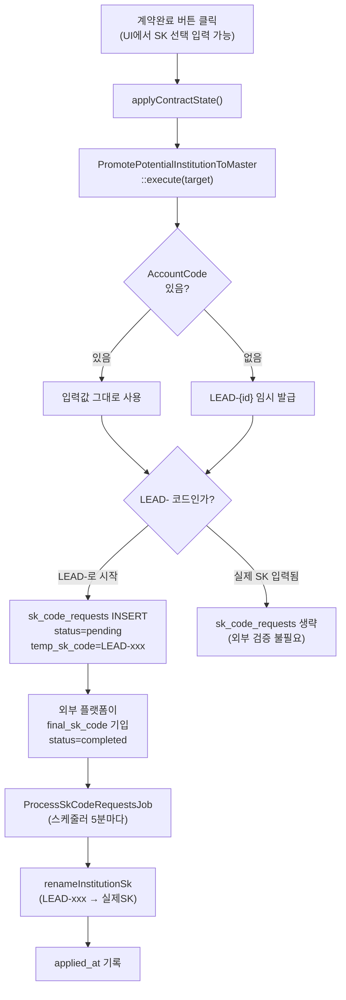

# SK CODE 계약완료 입력 (브릿지 테이블 방식)

## 전체 데이터 흐름



---

## 신규 파일 1: 마이그레이션

**파일**: `database/migrations/2026_05_07_170000_create_sk_code_requests_table.php`

기존 `external_assignment_inbound_logs` 마이그레이션 패턴을 그대로 따른다.

```php
Schema::create('sk_code_requests', function (Blueprint $table): void {
    $table->id();
    $table->unsignedBigInteger('co_new_target_id');  // S_CO_NewTarget.ID
    $table->string('institution_name', 200);          // 외부 확인용 기관명
    $table->string('temp_sk_code', 64);               // LEAD-xxx 임시 코드
    $table->string('final_sk_code', 64)->nullable();  // 외부 입력 확정 SK
    $table->string('status', 20)->default('pending'); // pending / completed / failed
    $table->text('error_message')->nullable();
    $table->timestamp('requested_at')->useCurrent();
    $table->timestamp('completed_at')->nullable();    // 외부가 completed로 변경한 시각
    $table->timestamp('applied_at')->nullable();      // 우리 스케줄러가 처리 완료한 시각
    $table->timestamps();

    $table->index(['status', 'applied_at']);
    $table->index('co_new_target_id');
    $table->index('temp_sk_code');
});
```

> `applied_at IS NULL` 조건으로 중복 처리를 방지한다.

---

## 신규 파일 2: Eloquent 모델

**파일**: `app/Models/SkCodeRequest.php`

```php
namespace App\Models;

use Illuminate\Database\Eloquent\Model;

class SkCodeRequest extends Model
{
    protected $fillable = [
        'co_new_target_id',
        'institution_name',
        'temp_sk_code',
        'final_sk_code',
        'status',
        'error_message',
        'requested_at',
        'completed_at',
        'applied_at',
    ];

    protected function casts(): array
    {
        return [
            'requested_at' => 'datetime',
            'completed_at' => 'datetime',
            'applied_at'   => 'datetime',
        ];
    }
}
```

---

## 신규 파일 3: 스케줄러 Job

**파일**: `app/Jobs/ProcessSkCodeRequestsJob.php`

기존 `PullInstitutionFromPartnerJob`과 동일한 구조(재시도/backoff 포함).

```php
namespace App\Jobs;

use App\Models\SkCodeRequest;
use App\Services\PotentialInstitutionSkCodeService;
use Illuminate\Contracts\Queue\ShouldQueue;
use Illuminate\Foundation\Queue\Queueable;
use Illuminate\Support\Facades\Log;

class ProcessSkCodeRequestsJob implements ShouldQueue
{
    use Queueable;

    public int $tries = 3;
    public array $backoff = [30, 120, 300];

    public function handle(PotentialInstitutionSkCodeService $skCodeService): void
    {
        SkCodeRequest::query()
            ->where('status', 'completed')
            ->whereNotNull('final_sk_code')
            ->whereNull('applied_at')          // 이미 처리된 건 제외
            ->get()
            ->each(function (SkCodeRequest $req) use ($skCodeService): void {
                try {
                    // LEAD-xxx → 실제 SK 전체 치환
                    // (S_AccountName, S_Account_Information, S_GSNumber,
                    //  S_CO_NewTarget.AccountCode, S_SupportInfo_Account 모두 업데이트)
                    $skCodeService->renameInstitutionSk(
                        $req->temp_sk_code,
                        (string) $req->final_sk_code
                    );

                    $req->update(['applied_at' => now()]);
                } catch (\Throwable $e) {
                    $req->update([
                        'status'        => 'failed',
                        'error_message' => $e->getMessage(),
                    ]);

                    Log::warning('sk_code_request_apply_failed', [
                        'id'            => $req->id,
                        'temp_sk_code'  => $req->temp_sk_code,
                        'final_sk_code' => $req->final_sk_code,
                        'error'         => $e->getMessage(),
                    ]);
                }
            });
    }
}
```

> `renameInstitutionSk`는 `$oldSk === $newSk`이면 즉시 반환하므로, 입력 중복은 안전하게 무시된다.

---

## 수정 파일 1: [`app/Livewire/PotentialInstitutionList.php`](app/Livewire/PotentialInstitutionList.php)

### 추가 프로퍼티

```php
// 계약완료 미니 모달용
public bool $showContractModal = false;
public ?int $pendingContractId = null;
public string $contractSkCode = '';

// 상세 모달 SK CODE 입력용
public string $detailModalSkCode = '';
```

### 추가 메서드 (2개)

```php
public function openContractModal(int $id): void
{
    $this->pendingContractId = $id;
    $this->contractSkCode = '';
    $this->showContractModal = true;
}

public function closeContractModal(): void
{
    $this->showContractModal = false;
    $this->pendingContractId = null;
    $this->contractSkCode = '';
}
```

### `markContractComplete()` 수정

`applyContractState()` 호출 전에 SK CODE 세팅 2줄 추가, 후에 `closeContractModal()` 추가.

```php
public function markContractComplete(int $id): void
{
    $target = CoNewTarget::query()->findOrFail($id);
    if ($target->IsContract) { return; }

    $inputSk = trim($this->contractSkCode);
    if ($inputSk !== '') {
        $target->AccountCode = $inputSk; // PromotePotential이 이 값 우선 사용
    }

    $this->applyContractState($target, true);
    $this->closeContractModal();
    session()->flash('success', '계약완료 처리되었습니다.');
}
```

### `commitDetailContract()` 수정

미계약→계약 전환 분기 진입 시 `detailModalSkCode` 세팅 추가.

```php
if ($contracted) {
    $inputSk = trim($this->detailModalSkCode);
    if ($inputSk !== '') {
        $target->AccountCode = $inputSk;
    }
}
$this->applyContractState($target, $contracted);
```

### `applyContractState()` 수정 (핵심)

기존 `$sk = app(PromotePotential...)->execute($target);` 바로 아래에 sk_code_requests INSERT 추가.
**LEAD- 코드가 발급된 경우에만** 삽입하여, 실제 SK를 직접 입력한 경우엔 테이블을 건드리지 않는다.

```php
private function applyContractState(CoNewTarget $target, bool $contracted): void
{
    DB::transaction(function () use ($target, $contracted): void {
        if ($contracted) {
            $target->update([
                'IsContract'     => true,
                'ContractedDate' => now()->toDateString(),
            ]);

            $sk = app(PromotePotentialInstitutionToMaster::class)->execute($target);

            // 추가: 임시(LEAD-) 코드가 발급된 경우 브릿지 테이블에 pending 레코드 생성
            if (str_starts_with($sk, 'LEAD-')) {
                SkCodeRequest::create([
                    'co_new_target_id' => (int) $target->ID,
                    'institution_name' => (string) ($target->AccountName ?? ''),
                    'temp_sk_code'     => $sk,
                    'status'           => 'pending',
                    'requested_at'     => now(),
                ]);
            }

            DB::afterCommit(function () use ($sk): void {
                SyncInstitutionOutboundJob::dispatchIf(
                    (bool) config('services.institution_outbound.enabled'),
                    $sk,
                    SyncOrigin::Local
                );
            });
        } else {
            $target->update(['IsContract' => false, 'ContractedDate' => null]);
        }
    });
}
```

### `closeDetailModal()` 수정

```php
$this->detailModalSkCode = '';  // 한 줄 추가
```

---

## 수정 파일 2: [`resources/views/livewire/potential-institution-list.blade.php`](resources/views/livewire/potential-institution-list.blade.php)

### 변경 1: 계약완료 버튼 교체 (176번 줄)

```html
{{-- 변경 전 --}}
<button wire:click.stop="markContractComplete({{ $target->ID }})" ...>

{{-- 변경 후 --}}
<button wire:click.stop="openContractModal({{ $target->ID }})" ...>
```

### 변경 2: 계약완료 미니 모달 추가 (로딩 인디케이터 앞)

```html
@if($showContractModal)
<div class="mochi-modal-overlay" wire:click.self="closeContractModal">
    <div class="mochi-modal-shell max-w-md flex flex-col" wire:click.stop>
        <div class="flex items-center justify-between px-6 py-4 border-b border-gray-200
                    bg-gradient-to-r from-orange-50/80 to-white">
            <h2 class="text-base font-semibold text-gray-900">계약 완료 처리</h2>
            <button wire:click="closeContractModal" class="text-gray-400 hover:text-gray-600 p-1 cursor-pointer">
                <svg class="w-5 h-5" fill="none" stroke="currentColor" viewBox="0 0 24 24">
                    <path stroke-linecap="round" stroke-linejoin="round" stroke-width="2" d="M6 18L18 6M6 6l12 12"/>
                </svg>
            </button>
        </div>
        <div class="px-6 py-5 space-y-4">
            <div>
                <label class="block text-sm font-medium text-gray-700 mb-1">
                    SK CODE <span class="text-gray-400 font-normal">(선택)</span>
                </label>
                <input type="text"
                       wire:model.defer="contractSkCode"
                       placeholder="예: ABC-001 — 비워두면 자동 발급"
                       class="w-full py-2 px-3 text-sm border border-gray-300 rounded-lg
                              focus:outline-none focus:ring-2 focus:ring-orange-400" />
                <p class="mt-1.5 text-xs text-gray-500">
                    비워두면 임시 코드(LEAD-xxx)가 자동 발급되고,
                    외부 플랫폼에서 확정 SK를 입력하면 자동 치환됩니다.
                </p>
            </div>
        </div>
        <div class="px-6 py-4 bg-gray-50 border-t border-gray-200 flex justify-end gap-2">
            <button type="button" wire:click="closeContractModal"
                    class="px-4 py-2 text-sm text-gray-700 border border-gray-300
                           rounded-lg hover:bg-gray-100 transition-colors cursor-pointer">
                취소
            </button>
            <button type="button"
                    wire:click="markContractComplete({{ $pendingContractId }})"
                    wire:loading.attr="disabled"
                    wire:target="markContractComplete"
                    class="px-4 py-2 text-sm font-medium text-white bg-orange-500
                           hover:bg-orange-600 rounded-lg transition-colors cursor-pointer">
                <span wire:loading.remove wire:target="markContractComplete">계약 완료 처리</span>
                <span wire:loading wire:target="markContractComplete">처리 중...</span>
            </button>
        </div>
    </div>
</div>
@endif
```

### 변경 3: 상세 모달 계약여부 행 아래 SK CODE 행 추가 (529번 줄 근처)

```html
{{-- 계약여부 <tr> 바로 아래에 삽입 --}}
@if(!($selectedTarget['is_contract'] ?? false))
<tr>
    <th class="px-3 py-2 bg-gray-50 text-left text-xs text-gray-500 font-medium">SK CODE</th>
    <td colspan="3" class="px-3 py-2" wire:click.stop>
        <input type="text"
               wire:model.defer="detailModalSkCode"
               placeholder="계약 처리 시 부여할 SK CODE (비우면 자동발급)"
               class="w-full max-w-xs py-1.5 px-2 text-sm border border-gray-300 rounded-lg
                      focus:outline-none focus:ring-2 focus:ring-blue-500" />
        <p class="mt-1 text-xs text-gray-400">비워두면 LEAD-xxx 임시 코드가 발급됩니다.</p>
    </td>
</tr>
@endif
```

---

## 수정 파일 3: [`routes/console.php`](routes/console.php)

기존 `PullInstitutionFromPartnerJob` 스케줄 바로 아래에 추가.

```php
Schedule::job(new ProcessSkCodeRequestsJob)
    ->everyFiveMinutes()
    ->withoutOverlapping();
```

---

## 외부 개발자에게 전달할 테이블 명세

외부 플랫폼 개발자는 아래 테이블에만 접근하면 된다. **우리 DB의 읽기+쓰기 계정을 이 테이블만 허용**하는 것을 권장한다.

### 접근 테이블: `sk_code_requests`

| 컬럼 | 타입 | 설명 | 외부 개발자 권한 |
|------|------|------|-----------------|
| `id` | BIGINT PK | - | READ |
| `co_new_target_id` | BIGINT | 우리 잠재기관 내부 ID (참고용) | READ |
| `institution_name` | VARCHAR(200) | 기관명 (확인용) | READ |
| `temp_sk_code` | VARCHAR(64) | 현재 임시 코드 (예: `LEAD-520`) | READ |
| `final_sk_code` | VARCHAR(64) NULL | **외부 개발자가 채워야 하는 컬럼** | **WRITE** |
| `status` | VARCHAR(20) | `pending` / `completed` / `failed` | **WRITE** |
| `requested_at` | TIMESTAMP | 우리 측 계약완료 시각 | READ |
| `completed_at` | TIMESTAMP NULL | 외부 입력 완료 시각 | **WRITE** |
| `applied_at` | TIMESTAMP NULL | 우리 스케줄러가 처리 완료한 시각 | READ |

### 외부 개발자 워크플로

1. `SELECT * FROM sk_code_requests WHERE status = 'pending'` 으로 처리 대기 목록 조회
2. `institution_name`으로 기관을 확인하고 확정 SK CODE를 결정
3. 아래 UPDATE 한 줄로 처리 완료 신호 전송:
   ```sql
   UPDATE sk_code_requests
   SET final_sk_code = 'ABC-001',
       status        = 'completed',
       completed_at  = NOW()
   WHERE id = ?
     AND status = 'pending';
   ```
4. 우리 스케줄러(5분 이내)가 자동으로 감지하여 기관 마스터에 반영한다.
5. 처리 완료 확인: `applied_at IS NOT NULL` 이면 우리 측 반영 완료.

> `status = 'failed'`로 바뀐 경우, `error_message` 컬럼을 확인하거나 우리 팀에 알려주면 된다.

---

## 전체 파일 변경 요약

| 구분 | 파일 | 내용 |
|------|------|------|
| 신규 | `database/migrations/2026_05_07_170000_create_sk_code_requests_table.php` | 브릿지 테이블 생성 |
| 신규 | `app/Models/SkCodeRequest.php` | Eloquent 모델 |
| 신규 | `app/Jobs/ProcessSkCodeRequestsJob.php` | SK 치환 스케줄러 Job |
| 수정 | `app/Livewire/PotentialInstitutionList.php` | 프로퍼티·메서드 추가, `applyContractState()` 수정 |
| 수정 | `resources/views/livewire/potential-institution-list.blade.php` | 미니 모달·SK 입력 필드 추가 |
| 수정 | `routes/console.php` | Job 스케줄 등록 |
