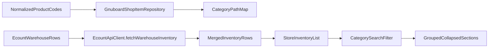

# Store 재고 카테고리 재구현 계획

## 목표와 확정된 방향

- Store 재고 화면에 **1~3차 카테고리 계층**(`ca_id/ca_id2/ca_id3`)을 반영한다.
- 상단 필터에 **카테고리 드롭다운(전체/카테고리별)**을 추가한다.
- 목록은 **카테고리 그룹 섹션(접기/펼치기)** 형태로 재구성한다.
- 기존 재고 소스(이카운트 재고 + 그누보드 보강 필드) 구조는 유지하되, 카테고리 메타데이터를 병합한다.
- `database/migrations/`* 추가 금지
- 카테고리 관련 Repository 메서드는 `SELECT`만 허용 (`insert/update/delete` 금지)
- 테스트도 읽기 시나리오 중심으로 작성 (운영 DB write 없음)

## 현재 구조 진단 (핵심)

- 재고 데이터 진입점: [app/Services/Store/StoreInventoryApiClient.php](/Users/boseokhur/Desktop/Mocchi 화면 Figma/mocchi-platform/app/Services/Store/StoreInventoryApiClient.php)
- 실제 목록 조립: [app/Services/Store/EcountApiClient.php](/Users/boseokhur/Desktop/Mocchi 화면 Figma/mocchi-platform/app/Services/Store/EcountApiClient.php)
- 그누보드 보강 조회 저장소: [app/Repositories/GrapeSeed/GnuboardShopItemRepository.php](/Users/boseokhur/Desktop/Mocchi 화면 Figma/mocchi-platform/app/Repositories/GrapeSeed/GnuboardShopItemRepository.php)
- 화면/필터/수동 페이지네이션: [app/Livewire/StoreInventoryList.php](/Users/boseokhur/Desktop/Mocchi 화면 Figma/mocchi-platform/app/Livewire/StoreInventoryList.php), [resources/views/livewire/store-inventory-list.blade.php](/Users/boseokhur/Desktop/Mocchi 화면 Figma/mocchi-platform/resources/views/livewire/store-inventory-list.blade.php)
- 현재 코드에는 `ca_id/ca_id2/ca_id3`, `shop_category` 계열 조회가 없다(신규 도입 필요).

## 구현 단계

### 1) 카테고리 데이터 계약(Contract) 정의

- [config/store.php](/Users/boseokhur/Desktop/Mocchi 화면 Figma/mocchi-platform/config/store.php)에 그누보드 카테고리 테이블/컬럼 설정 키를 추가한다.
  - 예: `category.table`, `category.id_column`, `category.name_column`, `item.category_columns`(1~3차)
- 목표는 DB 커스텀(접두사/컬럼명 변경)에도 안전하게 대응하는 것이다.

### 2) Repository 확장: 상품코드별 카테고리 경로 맵 제공

- [app/Repositories/GrapeSeed/GnuboardShopItemRepository.php](/Users/boseokhur/Desktop/Mocchi 화면 Figma/mocchi-platform/app/Repositories/GrapeSeed/GnuboardShopItemRepository.php)에 `product_code => category_path/category_keys` 맵 메서드를 추가한다.
- 핵심 처리:
  - `g5_shop_item`의 `ca_id/ca_id2/ca_id3` 조회
  - 카테고리 테이블(`g5_shop_category`)에서 이름 맵 일괄 조회
  - 누락 시 `미분류` fallback
- 성능 원칙:
  - 목록 row마다 쿼리하지 않고, **코드 집합 단위 배치 조회**
  - 기존 normalize/sanitize 패턴 재사용

### 3) 서비스 병합: 재고 row에 카테고리 메타 추가

- [app/Services/Store/EcountApiClient.php](/Users/boseokhur/Desktop/Mocchi 화면 Figma/mocchi-platform/app/Services/Store/EcountApiClient.php)의 `fetchWarehouseInventory()`에서 기존 맵(알림수량/실재고/이미지/최근차감)과 동일하게 카테고리 맵을 합친다.
- 각 row에 최소 필드 추가:
  - `category_l1`, `category_l2`, `category_l3`
  - `category_path`(예: `1차 > 2차 > 3차`)
  - `category_group_key`(그룹 렌더링/정렬용)

### 4) Livewire 재구성: 필터 + 그룹핑 + 페이지 동작 정리

- [app/Livewire/StoreInventoryList.php](/Users/boseokhur/Desktop/Mocchi 화면 Figma/mocchi-platform/app/Livewire/StoreInventoryList.php)
  - 상태 추가: `categoryFilter`
  - 계산 속성 추가: `categoryOptions`, `groupedPaginatedItems`
  - 필터 우선순위: 카테고리 → 검색어
  - 필터 변경 시 `page=1` 리셋
  - 그룹 접힘 상태는 Alpine 로컬 상태로 처리(서버 상태 최소화)

### 5) Blade 재구성: 드롭다운 + 카테고리 그룹 섹션

- [resources/views/livewire/store-inventory-list.blade.php](/Users/boseokhur/Desktop/Mocchi 화면 Figma/mocchi-platform/resources/views/livewire/store-inventory-list.blade.php)
  - `mochi-filter-card`에 카테고리 드롭다운 추가
  - 테이블 단일 목록 대신 카테고리 그룹 블록 반복
  - 각 그룹 헤더에 건수/합계 + 접기/펼치기 토글
  - 기존 `mochi-`* 토큰 유지로 디자인 일관성 확보
- 접기/펼치기 구현 패턴은 [resources/views/livewire/store-inventory-sku-manager.blade.php](/Users/boseokhur/Desktop/Mocchi 화면 Figma/mocchi-platform/resources/views/livewire/store-inventory-sku-manager.blade.php)의 Alpine 구조를 재사용한다.

### 6) 테스트 보강

- Feature: [tests/Feature/StoreInventoryPageTest.php](/Users/boseokhur/Desktop/Mocchi 화면 Figma/mocchi-platform/tests/Feature/StoreInventoryPageTest.php)
  - 카테고리 드롭다운 렌더
  - 카테고리 선택 시 해당 그룹/품목만 노출
  - 검색+카테고리 복합 필터 동작
  - 미분류 fallback 표시
- Unit: [tests/Unit/GnuboardShopItemRepositoryTest.php](/Users/boseokhur/Desktop/Mocchi 화면 Figma/mocchi-platform/tests/Unit/GnuboardShopItemRepositoryTest.php)
  - 카테고리 컬럼 누락/빈값/부분계층 매핑 케이스

## 데이터 흐름

## 리스크와 대응

- 스키마 차이 리스크: 카테고리 테이블/컬럼을 config로 외부화하고 부트 시 검증 로그를 추가한다.
- 성능 리스크: 카테고리명 조회를 배치 맵으로 1회 처리하고, 페이지 렌더마다 재조회하지 않도록 한다.
- 데이터 품질 리스크: `ca_id2/ca_id3` 누락 시 경로를 자동 축약하고 최종적으로 `미분류`로 강등한다.

## 완료 기준

- 필터에서 전체/카테고리 선택 가능
- 카테고리 그룹 섹션으로 목록 확인 가능(접기/펼치기 포함)
- 검색+카테고리 동시 필터 정상
- 기존 재고 수정/품목추가/페이지 이동 동작 회귀 없음

