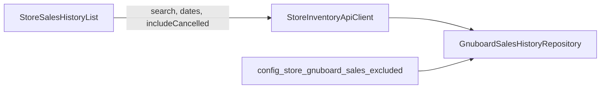

# Store 전체 판매내역: 취소 건 제외 이유 반영 구현 계획

## 제약: 그누보드 DB는 절대 변경하지 않음 (필수)

- 그누보드 쪽 DB(`store.gnuboard.connection` 등으로 붙는 DB)에 대해 **DDL(마이그레이션·ALTER·인덱스 추가), DML(INSERT/UPDATE/DELETE), 트리거/뷰 생성 등 일체 금지**.
- 본 계획의 단계 A·B는 **오직** 다음에만 한정된다.
  - Laravel 앱 설정(`config` / `.env`는 **앱 전용**, 그누보드 서버에 파일을 쓰는 것이 아님)
  - 앱 코드 내 **SELECT 조회**에서 기존과 같이 `WHERE`로 상태를 제외하던 로직을 **조건부로 적용**하거나 생략하는 것(토글 시에도 **읽기만**).
- 구현·리뷰 시 **그누보드 연결에 대한 쓰기 쿼리가 새로 생기지 않았는지** PR에서 한 번 더 확인한다.

## 배경(현 코드 동작)

- **전체 판매내역**은 [`StoreSalesHistoryList`](app/Livewire/StoreSalesHistoryList.php) → [`StoreInventoryApiClient::fetchAllPaginatedSaleHistories`](app/Services/Store/StoreInventoryApiClient.php) → [`GnuboardSalesHistoryRepository::getPaginatedAllSaleHistories`](app/Repositories/GrapeSeed/GnuboardSalesHistoryRepository.php) 경로로만 조회되며, **소스는 `gnuboard`일 때만** 해당됩니다.
- Repository는 `config('store.gnuboard.sales.excluded_order_statuses')` / `excluded_cart_statuses`에 들어 있는 값과 일치하는 **`od_status` / `ct_status` 행을 SQL에서 제외**합니다. 기본 env는 [`config/store.php`](config/store.php) 기준 `취소,주문취소` / `취소`입니다.
- 동일 패턴의 제외 로직이 **품목별 최근 내역**용 private 메서드(`fetchHistoryRowsForCodeBetween` 등)에도 있으므로, “전체 화면만 취소 포함”이면 **페이지네이션 메서드만** 파라미터화하는 것이 범위를 좁힙니다(품목 모달·재고 연동 쪽은 기본 제외 유지 권장).

## 구현 방향(권장: 2단계)

### 단계 A — 운영·문서(코드 변경 최소, 즉시 가치)

- [`docs/platform-user-guide.md`](docs/platform-user-guide.md) 또는 Store 판매내역 전용 짧은 섹션에 다음을 명시:
  - 취소/주문취소가 안 보이는 이유(`excluded_*`).
  - **전역**으로 취소까지 보이게 하려면 `.env`에서 `STORE_GNUBOARD_EXCLUDED_ORDER_STATUSES` / `STORE_GNUBOARD_EXCLUDED_CART_STATUSES`를 비우거나 값 조정(그누보드 실제 상태 문자열과 **완전 일치**해야 함).
- [`.env.example`](.env.example)에 위 두 변수가 이미 있다면 **주석으로 “비우면 취소 건도 조회됨”** 보강.

**리스크**: env 변경은 **전역**이라 다른 그누보드 판매 조회(품목별 히스토리)에도 영향을 줄 수 있음 → 단계 B가 제품적으로 안전.

### 단계 B — UI “취소 포함” 토글(권장 제품 동작)

**목표**: 기본은 현재와 동일(취소 제외). 사용자가 **이 화면에서만** 취소·주문취소 라인을 포함해 조회.

1. **Livewire 상태** ([`app/Livewire/StoreSalesHistoryList.php`](app/Livewire/StoreSalesHistoryList.php))
   - `public bool $includeCancelledOrders = false;` (또는 `includeExcludedStatuses`)
   - 토글 변경 시 `$this->resetPage()` (검색과 동일 패턴).

2. **서비스 시그니처** ([`app/Services/Store/StoreInventoryApiClient.php`](app/Services/Store/StoreInventoryApiClient.php))
   - `fetchAllPaginatedSaleHistories(..., bool $includeCancelledOrders = false)` 추가(또는 옵션 배열로 확장해 향후 다른 필터에 대비).
   - `gnuboard` 분기에서 Repository에 전달.

3. **Repository** ([`app/Repositories/GrapeSeed/GnuboardSalesHistoryRepository.php`](app/Repositories/GrapeSeed/GnuboardSalesHistoryRepository.php))
   - `getPaginatedAllSaleHistories(..., bool $applyStatusExclusions = true)` 형태 권장: `true`일 때만 기존 `excluded_order_statuses` / `excluded_cart_statuses` 블록 적용.
   - `false`이면 해당 `where` 두 블록 생략 → 취소 주문도 날짜·검색·`ct_qty > 0` 조건 안에서 노출.

4. **Blade** ([`resources/views/livewire/store-sales-history-list.blade.php`](resources/views/livewire/store-sales-history-list.blade.php))
   - 필터 카드(날짜/조회 옆)에 체크박스: “취소·주문취소 주문 포함” + 한 줄 설명(그누보드 상태 기준).
   - 접근성: `label` + `input` 연결.

5. **테스트** ([`tests/Feature/StoreSalesHistoryGnuboardPageTest.php`](tests/Feature/StoreSalesHistoryGnuboardPageTest.php) 등)
   - 기존처럼 excluded 설정 시 취소 주문 **미노출** 회귀.
   - `includeCancelledOrders = true`로 Livewire 호출 시 취소 주문 **노출**(이미 fixture에 `OD-CANCEL` 패턴이 있으면 재사용).

6. **문서**
   - 단계 A 내용 + “화면 체크 시 일시적으로만 포함” 문구 추가.

**주의(시니어 체크리스트)**

- **문자열 일치**: 제외/포함 모두 그누보드 DB에 저장된 `od_status`/`ct_status` 값과 **정확히** 맞아야 함(공백·대소문자는 `normalizeStatusFilters` 동작 확인).
- **`ct_qty > 0`**: 취소 주문이 수량 0으로 남는 스키마면, 토글을 켜도 행이 없을 수 있음 → 문서에 한 줄 명시.
- **성능**: 제외 해제 시 결과 집합 증가 → 기존 `max_rows_per_query`·페이지 크기·기간 제한 유지.

## 완료 기준

- 기본 조회: 기존과 동일하게 취소 제외(회귀 없음).
- “취소 포함” 켠 경우: 동일 기간·검색에서 취소 상태 주문이 테이블에 나타남.
- Feature 테스트로 위 두 가지 검증.
- 운영자가 `.env` 없이도 화면에서 원인·해결을 이해할 수 있는 문서.
- **그누보드 DB에 대한 쓰기·스키마 변경 diff 없음**(Repository는 기존과 동일하게 SELECT 경로만).

## 범위 밖(별도 결정 시)

- 품목별 판매 모달/이카운트 소스까지 동일 토글 연동(요구가 생기면 동일 플래그를 API에 전파하는 2차 작업).
