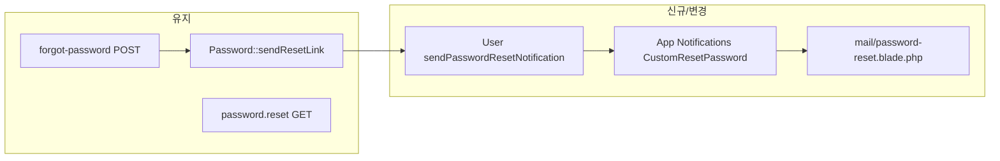

# 비밀번호 재설정 메일 커스터마이징 계획

## 요청 확정 (2026-05-13)

- 사용자 확인: **기본 Laravel 재설정 메일이 아닌, 브랜드/한글 등 커스터마이징을 원함.** 아래 기술 방향(커스텀 Notification + Blade + `User` 오버라이드)으로 진행하면 요구를 충족함.
- **카피·로고**: 제목·CTA·로고는 사용자 확정 완료. 인사·만료·미요청 문구·발신명·언어(한글만 등)는 미지정 항목은 **구현 시 자연스러운 한글 기본안**으로 채움(변경 원하면 구현 전에 한 줄만 추가).

## 구현 전 확정 사항 (카피·브랜딩)

| 항목 | 확정 내용 |
|------|-----------|
| 메일 제목 (Subject) | **비밀번호 재설정 링크를 보내드립니다.** |
| 발신 표시명 | 미지정 → **`MAIL_FROM_NAME` 유지** (별도 요청 시 config로 분리) |
| 인사 / 상단 한 줄 | 미지정 → 구현 시 한 줄 인사 + 재설정 요청 안내(한글) |
| CTA 버튼 문구 | **재설하기** |
| 만료 안내 | `auth.passwords.*.expire` 분 반영 한글 문구(구현 시 톤 통일) |
| 미요청 시 / 문의 | 미지정 → 본인 아닐 경우 무시 한 줄 + 필요 시 문의 경로는 기존 앱 관행 따름 |
| 로고 | **사용함** — [`support-report-stored`](resources/views/mail/support-report-stored.blade.php)와 동일하게 `asset('images/logo_new2.png')` (또는 해당 뷰와 동일 경로) |
| 언어 | 미지정 → **한글 본문**(영문 병기 없음) |

**구현 시 반영할 고정 값**

- 알림/Mailable의 **제목**은 위 문자열 그대로 사용(마침표 포함 여부는 구현 시 제목 필드 관례에 맞춰 조정 가능, 기본은 사용자 문구 그대로).
- 버튼/액션 라벨: **재설하기**.

## 현재 상태

- 발송: Breeze [`routes/auth.php`](routes/auth.php)의 `password.email` + [`PeopleEmployeesList::sendResetLink`](app/Livewire/PeopleEmployeesList.php) 등에서 `Password::sendResetLink(['email' => ...])` → **`User`에 `Illuminate\Auth\Notifications\ResetPassword`** 전달.
- [`app/Models/User.php`](app/Models/User.php): `sendPasswordResetNotification` 미구현 → **기본 Laravel 메일**(영문, Laravel 로고·서명).
- 기존 트랜잭션 메일 참고: [`app/Mail/SupportReportStoredMail.php`](app/Mail/SupportReportStoredMail.php) + [`resources/views/mail/`](resources/views/mail/) 패턴(Blade Mailable).

## 구현 방향 (권장)

1. **`App\Notifications\CustomResetPassword` (이름은 팀 컨벤션에 맞게 조정 가능)**  
   - `Illuminate\Notifications\Notification` + `Illuminate\Notifications\Messages\MailMessage` **또는** `Mailable` + `Mail::send` 대신 `toMail()`에서 `MailMessage`/`view()` 혼합.  
   - **필수**: 기본 [`ResetPassword`](vendor/laravel/framework/src/Illuminate/Auth/Notifications/ResetPassword.php)와 동일하게  
     - `$this->token` 보관  
     - 재설정 URL = `route('password.reset', ['token' => $this->token, 'email' => $notifiable->getEmailForPasswordReset()], absolute: true)` (Laravel 13 / Breeze [`password.reset`](routes/auth.php)와 일치).  
   - **만료 문구**: `config('auth.passwords.'.config('auth.defaults.passwords').'.expire')` (보통 60) 사용해 “N분 내 유효” 한글 표기.

2. **[`app/Models/User.php`](app/Models/User.php)**  
   - `sendPasswordResetNotification(string $token): void` 구현 → `$this->notify(new CustomResetPassword($token))`.  
   - 기본 알림 클래스를 쓰지 않게 되므로 **모든 재설정 메일**(직원 관리에서 발송 + `/forgot-password` 공개 폼)이 동일 템플릿으로 통일됨(의도 확인용: 둘 다 같은 브랜딩이 맞는지).

3. **뷰·카피**  
   - `resources/views/mail/password-reset.blade.php` (HTML) + 필요 시 `password-reset-text.blade.php` (plain).  
   - **확정**: 제목「비밀번호 재설정 링크를 보내드립니다.」, 주 버튼 라벨 **재설하기**, 상단 **로고 표시**(support-report-stored와 동일 `asset` 패턴).  
   - 그 외 본문(인사, 만료 N분, 미요청 시 무시, URL 복사용 텍스트 링크)은 한글 기본안으로 작성.

4. **설정 분리 (선택, 권장)**  
   - `config/password_reset_mail.php` 또는 `lang/ko/passwords.php` 확장: 제목(`MAIL_FROM_NAME`과 별도 subject), 상단 인사, 푸터 한 줄.  
   - `.env.example`에 예: `MAIL_PASSWORD_RESET_SUBJECT` 정도만 추가해도 충분.

5. **테스트 수정**  
   - [`tests/Feature/Auth/PasswordResetTest.php`](tests/Feature/Auth/PasswordResetTest.php): `ResetPassword::class` → **`CustomResetPassword::class`**, 콜백 내 `$notification->token` 접근은 동일 유지.  
   - [`tests/Feature/PeopleEmployeePermissionsTest.php`](tests/Feature/PeopleEmployeePermissionsTest.php) 등 `ResetPassword::class`를 assert하는 곳 **전부 grep 후 동일 교체**.

6. **수동 검증**  
   - `MAIL_MAILER=log`에서 로그/스택에 HTML 확인, 또는 실 SMTP로 1통 발송.  
   - 링크 클릭 → [`NewPasswordController`](app/Http/Controllers/Auth/NewPasswordController.php) 폼까지 동작 회귀.

## 범위 밖 / 주의

- **벤더 뷰 전체 publish**(`vendor:publish` notifications)는 업그레이드 부담이 있어, 위처럼 **앱 알림 + 앱 Blade**가 유지보수에 유리함.  
- 카피 언어: **한글**(영문 병기 없음). 발신명은 `MAIL_FROM_NAME` 유지.

## 수용 기준

- `/forgot-password` 및 직원 관리 “비밀번호 재설정 메일 발송” 모두 **동일 커스텀 알림** 사용.  
- 메일 본문에 **재설정 URL**이 포함되고, 기존 테스트와 동일하게 **토큰으로 `GET /reset-password/{token}`** 접근 가능.  
- 기존 Feature 테스트 전부 통과(알림 클래스 assert만 교체).
