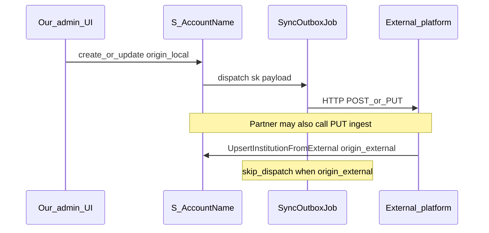

# 잠재기관 계약 → 기관 마스터 + 우리 쪽 수정 시 타 플랫폼 연동

## 배경·목표

- **현재**: [`PotentialInstitutionList::applyContractState`](app/Livewire/PotentialInstitutionList.php)는 `CoNewTarget`만 갱신하고 [`S_AccountName`](app/Models/Institution.php)에는 반영하지 않음. 테스트는 계약 후 마스터 부재를 전제로 함 ([`PotentialInstitutionListTest`](tests/Feature/PotentialInstitutionListTest.php)).
- **목표 A (계약)**: **계약이 최초로 완료**되면 기관 리스트(마스터)에 동기화하고 SK를 확보(`LEAD-{id}` 등, [`PotentialInstitutionSkCodeService`](app/Services/PotentialInstitutionSkCodeService.php)).
- **목표 B (양방향 중 “우리→상대”)**: **우리 플랫폼에서 기관 정보에 수정이 생기면** 타 플랫폼에도 반영되도록 **Outbound 연동**을 구현한다. (이전 계획의 “push 비목표”는 이 요구로 **폐기**.)
- **유지**: 상대가 우리 마스터를 갱신하는 [`PUT .../internal/institutions/{sk}`](routes/api.php) + [`UpsertInstitutionFromExternal`](app/Actions/UpsertInstitutionFromExternal.php) + Bearer([`config/services.php`](config/services.php) `external_institutions`).

## 설계 원칙

### 계약 승격 (기존 계획과 동일)

1. **단일 트랜잭션**: 계약 플래그 갱신 + 마스터 승격 + 지원 이력 백필.
2. **멱등성**: SK 기준으로 `Institution` 중복 생성 방지 ([`CreateInstitution`](app/Actions/CreateInstitution.php)은 raw `create`).
3. **SK 정책**: `resolveForManualRegistration` / `LEAD-{ID}`; 확정 SK는 [`applyExternalSk`](app/Services/PotentialInstitutionSkCodeService.php) 유지.
4. **미계약 복귈**: `S_AccountName` 자동 삭제 없음.

### Outbound (신규)

5. **단일 진입점**: 마스터/담당 변경 후 “상대에게 알린다” 로직은 **한 서비스 또는 Job**으로 모은다(예: `SyncInstitutionToExternalPlatform::dispatch($sk, array $patch, SyncOrigin $origin)`). Livewire·Action에서 직접 `Http::` 호출 분산 금지.
6. **비동기 + 재시도**: 네트워크·상대 장애 대비 **Queue Job**(timeout, backoff, 실패 시 `failed_jobs` / 로그). 설정 URL이 비어 있으면 **no-op**(로컬·스테이징 안전).
7. **순환 방지(필수)**: [`UpsertInstitutionFromExternal`](app/Actions/UpsertInstitutionFromExternal.php) 실행 경로에서는 Outbound를 **디스패치하지 않음**(`SyncOrigin::ExternalIngest` 등). 그렇지 않으면 상대 PATCH → 우리 저장 → 우리 push → 상대 → 다시 우리… **무한 루프** 위험.
8. **변경 단위**: 1차는 **명시적 쓰기 경로**에서만 디스패치(아래 목록). `Institution` 모델 `saved` 글로벌 이벤트는 ingest와 섞이기 쉬워 **1차에서는 비권장**(순환·이중 발화 디버깅 어려움).
9. **페이로드**: 상대 API 스키마가 확정 전이면, 우리 쪽은 **내부 DTO 또는 `UpsertExternalInstitutionRequest`와 동형의 snake 배열**로 정규화한 뒤 Job에서 JSON 인코딩. URL·토큰·경로는 `config/services.php` 신규 키(예: `institution_outbound.base_url`, `bearer_token`, `enabled`).

### 우리 쪽 수정이 일어나는 코드 위치(디스패치 후보)

- [`InstitutionList`](app/Livewire/InstitutionList.php): `$institution->update([...])` 및 SK 변경 시 연쇄 업데이트 직후.
- [`CreateInstitution`](app/Actions/CreateInstitution.php): 신규 생성 직후(생성=상대에도 신규 반영 필요 시).
- **승격 Action**(`PromotePotentialInstitutionToMaster`): 마스터 최초 생성 직후.
- (해당 시) [`PotentialInstitutionSkCodeService::applyExternalSk`](app/Services/PotentialInstitutionSkCodeService.php): 이 경로는 **상대가 이미 준 SK**이므로 일반적으로 Outbound **불필요**—상대가 주도. 필요하면 “통지만” 별도 정책.

## 구현 단계

### 1) 도메인 Action: 계약 승격

- `App\Actions\PromotePotentialInstitutionToMaster` (명칭 가변).
- 책임: `AccountCode` 확보, `Institution` 멱등 생성(`CreateInstitution` 재사용), `SupportRecord` `SK_Code` 백필(`potential_target_id` 존재 시).
- 승격 직후: `SyncOrigin::Local`로 Outbound Job 디스패치(설정 on일 때만).

### 2) Livewire: 계약 상태

- [`PotentialInstitutionList::applyContractState`](app/Livewire/PotentialInstitutionList.php): 트랜잭션 + false→true 시 승격 Action 호출.

### 3) Outbound 모듈

- `App\Contracts\PushesInstitutionChangesExternally` 또는 단일 Job 클래스.
- `SyncInstitutionToExternalJob`: 인자 `string $sk`, `array $normalizedPatch`, `SyncOrigin $origin`. `origin === ExternalIngest`면 즉시 return.
- `config/services.php`에 `institution_outbound` 섹션 추가(또는 동일 도메인 키 확장): `enabled`, `base_url`, `path_template` 또는 전체 URL, `bearer_token`, `timeout`.
- Job 본문: `Http::withToken(...)->timeout(...)->post|put(...)` — **메서드·경로는 상대 스펙 확정 후 고정**(계획 단계에서는 placeholder + env).

### 4) Ingest 쪽 순환 차단

- [`UpsertInstitutionFromExternal::execute`](app/Actions/UpsertInstitutionFromExternal.php) 전체를 `DB::transaction`으로 감싸고 있으므로, 트랜잭션 **커밋 성공 후**에도 Job을 쏘지 않도록 **호출부에서만** origin을 넘기거나, Action 내부에서 `if ($origin !== ExternalIngest)` 가드.

### 5) 권한(권장)

- 계약 변경 메서드에 `Gate::authorize('managePotentialInstitutions')`.

### 6) 테스트

- **계약 승격**: [`PotentialInstitutionListTest`](tests/Feature/PotentialInstitutionListTest.php) 스키마에 `LS`/`GS_K`/`GS_E`, 계약 후 `assertDatabaseHas`.
- **Outbound**: 새 Feature 테스트에서 `Http::fake()`로 상대 URL에 요청 1회 검증; `config`에서 outbound 비활성/URL 공백 시 **HTTP 0회**; `UpsertInstitutionFromExternal` 호출 후에는 **디스패치 없음**(Job `::assertNothingDispatched` 또는 fakes).
- **InstitutionList / CreateInstitution**: 저장 후 Job 디스패치 여부 최소 1건씩(과다 테스트는 지양).

### 7) 운영

- 상대 팀과 **페이로드 필드·HTTP 메서드·멱등 키(예: SK + updated_at)** 합의.
- 로그: `Log::info('institution_outbound_sync', ['sk' => ..., 'keys' => ...])`(PII 주의).

## 리스크·완화

| 리스크 | 완화 |
|--------|------|
| ingest ↔ outbound 순환 | `SyncOrigin` 가드 + ingest 경로에서 Job 미발행 |
| 이중 전송 | Job에 idempotency-key 헤더 또는 마지막 동기화 해시 비교(후속) |
| 트랜잭션 내 HTTP | Job으로 커밋 이후 전송 |
| 부분 실패 | 큐 재시도 + DLQ(`failed_jobs`) 모니터링 안내 |

## 산출물 체크리스트

- [ ] `PromotePotentialInstitutionToMaster` + 계약 연동 + 테스트
- [ ] Outbound Job + `services` 설정 + 순환 방지 + `Http::fake` 테스트
- [ ] `InstitutionList` / `CreateInstitution` (및 승격 Action)에서 로컬 origin 디스패치
- [ ] `UpsertInstitutionFromExternal` 경로에서 Outbound 미발행 검증
- [ ] (선택) 계약 메서드 `Gate` 검증
